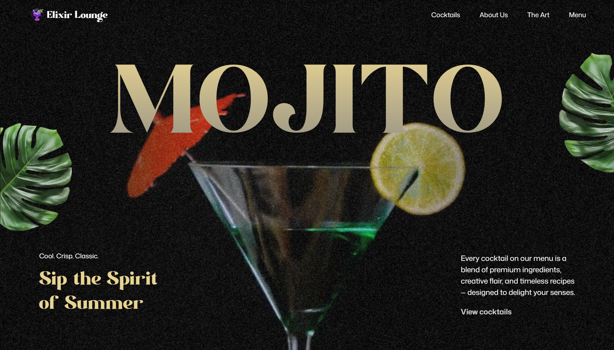

<div align="center">
    <a href="https://elixir-lounge.vercel.app/" target="_blank">
      
    </a>
</div>

# 🏙️ Elixir Lounge Website

A modern and dynamic website. Built with **Next.js** for fast and scalable performance, and **GSAP (GreenSock Animation Platform)** for seamless, visually engaging animations throughout the site.

---

## <a name="tech-stack">⚙️ Tech Stack</a>

- **[GSAP](https://gsap.com/)** is a powerful JavaScript animation library used in this project to create dynamic, scroll-driven visuals. Features include SplitText animations for bold text reveals, ScrollTrigger for timeline control, parallax scrolling, pinned sections, scroll-synced video playback, seamless multi-section timelines, image masking effects, and a fully custom animated carousel.

- **[React](https://react.dev/)** is a declarative JavaScript library for building interactive UIs. It provides the component structure for modular development, allowing smooth integration of GSAP animations, reusable logic for scroll behavior, and support for responsive layout and state-driven UI features like carousels and video sections.

- **[Tailwind CSS](https://tailwindcss.com/)** is a utility-first CSS framework that allows developers to design custom user interfaces by applying low-level utility classes directly in HTML, streamlining the design process.

- **[NextJs](https://nextjs.org/)** Next.js powers this project with a fast, flexible development environment, offering features like instant hot reloading, quick startup, and optimized production builds. Its built-in image optimization ensures efficient loading and responsive performance—perfect for an animation-rich React site that demands smooth interactions and real-time development feedback with minimal configuration.

---

## <a name="features">🔋 Features</a>

👉 **SplitText Animations**: Create impactful text reveals using GSAP’s SplitText for dynamic intros and section highlights.

👉 **ScrollTrigger Effects**: Power scroll-based animations and timeline control with GSAP’s ScrollTrigger.

👉 **Parallax Scrolling**: Add immersive depth with smooth parallax effects that respond to user scroll.

👉 **Pinned Sections**: Lock sections in view while animating content for engaging scroll experiences.

👉 **Scroll-Synced Video Playback**: Sync video progress with scroll position for cinematic storytelling.

👉 **Image Masking Effects**: Use scroll-triggered pins and masks for visually striking image transitions.

👉 **Custom Carousel**: Build a fully customized carousel with multiple navigation options and animated slides.

👉 **Seamless Timeline Animations**: Craft smooth animation timelines that span across multiple sections.

👉 **Responsive Design**: Ensure fluid UI and adaptive GSAP animations across all screen sizes.

And many more, including optimized video, image performance!

---

## <a name="quick-start">🤸 Quick Start</a>

Follow these steps to set up the project locally on your machine.

**Prerequisites**

Make sure you have the following installed on your machine:

- [Git](https://git-scm.com/)
- [Node.js](https://nodejs.org/en)
- [npm](https://www.npmjs.com/) (Node Package Manager)

**Cloning the Repository**

```bash
git clone https://github.com/MdZaferEqbal/elixir-lounge.git
cd elixir-lounge
```

**Installation**

Install the project dependencies using npm:

```bash
npm install
```

**Running the Project**

```bash
npm run dev
```

Open [http://localhost:3000](http://localhost:3000) in your browser to view the project.
